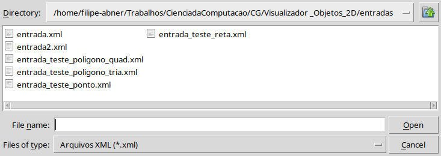

# 🧭 Interactive 2D Object Viewer with Transformations, Clipping and Viewport

This project is an interactive graphical tool developed in Python that allows visualizing, transforming, and clipping 2D geometric objects in a coordinate system based on a window and viewport. The system simulates important stages of a 2D graphics pipeline, such as coordinate transformation, clipping, and rendering.

## 🎯 Objective

The project aims to provide a functional graphical environment for manipulating and displaying 2D objects with focus on the following aspects:

- Coordinate transformation from world system to viewport system.
- Interaction with the scene through window movement, rotation, and scaling.
- Application of classical clipping algorithms to display only the objects visible in the viewport.

## 🛠️ Features

### Part 1
- 📂 Reading XML files containing objects (points, lines, and polygons), window, and viewport.
- 🖼️ Graphical rendering of objects using `tkinter` and canvas.
- 🎮 Window movement via arrow keys.
- 🔁 Automatic recalculation of object coordinates in the viewport.
- 💾 Export of XML file with transformed coordinates.
- 🗺️ Minimap to improve perception of window position.

### Part 2
- ➕ Buttons to move, rotate, and resize the window.
- 🔄 Transformations around the window’s center: translation, rotation, and scaling.
- 🎯 Transformation to Normalized Coordinate System (NCS).
- ✂️ Clipping of:
  - Points
  - Lines: Algorithms **Cohen-Sutherland** and **Liang-Barsky**
  - Polygons: Algorithm **Weiler-Atherton**
- ✅ Only objects visible after clipping are rendered.
- 🎨 Support for custom colors via the `cor` attribute in the XML.

## 📦 XML File Structure

The system uses XML files with the following structure:
- `Window` and `Viewport`: Defined by their bounds.
- Objects:
  - `Ponto2D`: Coordinates (x, y)
  - `Reta2D`: Two distinct points
  - `Polígono2D`: List of connected points
- Output also contains coordinates transformed to viewport.

## 📚 Technologies Used

- `Python 3`
- `tkinter` — graphical interface
- `xml.etree.ElementTree` — XML parsing and writing
- `numpy` — mathematical operations
- Classic clipping algorithms implemented from scratch

## 📸 Interface

The graphical interface includes:
- Main drawing area (viewport)
- Minimap with the world view
- Controls:
  - Arrow keys to move the window
  - Buttons to zoom, shrink, and rotate the window
  - Dropdown to select line clipping algorithm

## Dependencies
### Ubuntu/Debian
```sudo apt install python3-tk```

### Python
```pip install numpy ```<br>
```pip install ipykernel```

## How to Use
1. Run the file ```interface.ipynb``` and the following interface will appear.

<p align="center">
  
</p>

2. Click on ``` Arquivo -> Abrir``` 

<p align="center">
  
</p>

3. Choose one of the input files available in [`entradas`](entradas), or create a new file and place it in that directory.

<p align="center">
  
</p>

4. Choose one of the line clipping algorithms (1 or 2).

<p align="center">
  
</p>

5. Confirm your selection.

<p align="center">
  
</p>

6. You're all set! You can now move and view all geometric shapes freely.

<p align="center">
  
</p>

## Report

### 📌 Introduction

- The first relevant concept is the **viewport**, which is the area on the device's screen where the figures are drawn by the program. Associated with it is the **window**, which is the section of the world that will be rendered in the viewport. Even though the window and viewport may differ in size and proportions, maintaining aspect ratio is important to avoid rendering distortion.

- To bring images from the window to the viewport, it is not recommended that the coordinates be converted from 1 to 1, since the viewport can have different sizes, considering that, for example, devices with different screen sizes are used. Therefore, the **viewport transformation** is necessary, which is a calculation applied to all points to convert them from the window coordinates to the viewport coordinates, automatically adjusting for devices with different screen sizes.

The **window** can undergo three main types of transformations:

- **Translation**: moves the window along the x and y axes.
- **Rotation**: rotates the window on its own axis.
- **Scale**: allows zooming in and zooming out.

- In addition, the points are normalized to a **normalized coordinate plane** (between -1 and 1), which facilitates transformations and the application of algorithms such as clipping, in addition to keeping the coordinates of the window at the center of the world and doing the same with the figures so that the proportion is maintained.

- With each movement made to the window, all the desired calculations related to rendering are applied to all points in the world, even if these points are not inside the window, which generates a large amount of unnecessary calculations performed by the GPU. To avoid this, clipping algorithms were created. **Clipping** is applied to prevent points outside the window from undergoing the viewport transformation, optimizing performance by eliminating unnecessary calculations.

### 🛠️ Implementation

The implementation was developed in Jupyter Notebooks. Most of the logic resides in the `Visualizacao` class, with extra functionality in external files.

#### Representations:
- **Window, viewport, and NCS (Normalized Coordinate System)**: dictionaries with `xmin`, `xmax`, `ymin`, `ymax`.
- **Geometric objects (Point, Line, Polygon)**: implemented as Python classes.

#### Interface:
- The interface has buttons for translation, rotation, and scaling. On each action:

1. Points are normalized to the NCS.
2. Clipping algorithms are applied.
3. The viewport transformation is calculated.
4. Shapes are rendered via `tkinter`.

- The transformation matrix for the NCS is applied to the window only once during execution. After that, it’s only applied to world points.

### ✂️ Clipping

The main notebook (`interface.ipynb`) uses the following auxiliary files:
- `poligonos.py`: polygon clipping and shape definitions.
- `reta_liang.py`: Liang-Barsky line clipping.
- `reta_cohen.py`: Cohen-Sutherland line clipping.

### 🧮 Clipping Algorithms

#### 🔹 Cohen-Sutherland

- Uses **4-bit region codes** to indicate a point's position relative to the window.
- Three main cases:
  1. Completely inside (both codes = `0000`)
  2. Completely outside (AND of the codes ≠ `0000`)
  3. Partially inside (AND = `0000`, but one code ≠ `0000`)

If the line needs clipping, we find the intersection point of the line with the edge of the corresponding window, replace the point outside the window with the intersection point, and then repeat the process until the line is completely inside or outside the window. After clipping, the resulting line (if visible) will be drawn. 

> Performs intersections iteratively until the visibility of the line is determined.

#### 🔹 Liang-Barsky

- The Liang-Barsky algorithm uses **parametric equations** to detect intersections, and is an efficient technique for detecting collisions or performing clipping of line segments in relation to a rectangular region (clipping window). It is an improvement over the Cohen-Sutherland algorithm, as it avoids the need to calculate intersections for all edges of the window, using directly the parametric equations of the line. 

- In this way, the algorithm detects the intersections and then returns the line with the points inside the window, if any.

#### 🔹 Weiler-Atherton

- The algorithm begins by identifying all the intersection points between the edges of the polygon and the edges of the window. During this process:
- Each intersection point is marked with an orientation, indicating whether it is an entry point (when the edge of the polygon enters the window) or an exit point (when the edge of the polygon leaves the window).
- After determining the intersection points, the algorithm builds two circular lists that
organize these points:
- Polygon List: Contains all the original vertices of the polygon, supplemented by the identified intersection points. These points are inserted in the order in which they appear along the polygon, preserving the clockwise direction.
- Window List: Contains the vertices of the clipping window, also supplemented by the intersection points, ordered in a clockwise direction. Both lists preserve the original topology of the shapes, including the intersection points. -With the circular lists ready, the algorithm begins the process of constructing the resulting polygon, representing the portion of the polygon that is contained in the window. The process is iterative and follows these steps:

**1. Search for Entry Points: The algorithm starts in the polygon list, looking for the next entry point. <br>**
**2. When processing the entry point, its orientation is marked as used. <br>**
**3. Go to the Exit Point: From the entry point, it goes through the points in the polygon list until it finds the next exit point. <br>**
**4. Switch to the Window List: At the exit point, the algorithm switches to the window list, looking for the next corresponding point. <br>**
**5. When processing the exit point, its orientation is marked as used. <br>**
**6. Go to the Entry Point: From this exit point, the algorithm goes through the window list until it finds the next entry point. <br>**
**7. Return to the Polygon List: When identifying the entry point in the window, the algorithm returns to the polygon list, connecting the points and continuing the process. <br>**

- This cycle repeats until all the polygon's entry points have been used.

## 📝 Notes

- The system is modular, designed for flexibility and easy maintenance.
- Input and output XML files follow the same structure, including transformed data.

## Contributing

```Contributions are welcome!```
- For major changes, please open an issue first to discuss what you'd like to modify.

## Developers

|   | Name             | Github                         | 
| -------------------------------------------------------------------------------------------- | ---------------- | ------------------------------ |
|  | Filipe Abner     | https://github.com/FilipeAbner |
|  | Lucas Freitas     | https://github.com/LucasFreitaslpf1 |
